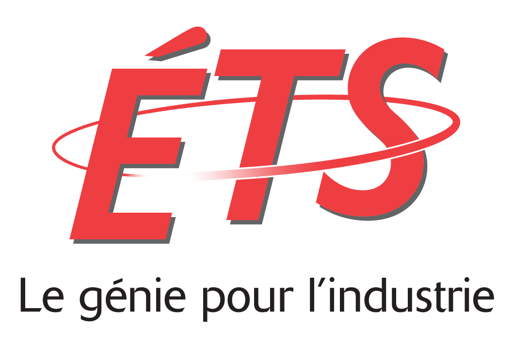
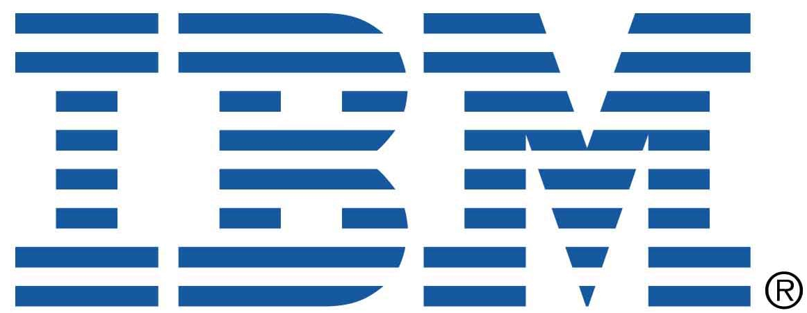

## Project Description

Network softwarization will revolutionize how network and computing infrastructures are designed and operated to deliver services and applications with greater agility and cost effectiveness. Software-Defined Networking (SDN) and Network Function Virtualization (NFV) are two expressions of network softwarization. SDN enables fast innovation by making the network programmable, and it leads to greater responsiveness, security, efficiency, and cost effectiveness. NFV replaces equipment, such as load balancers, firewalls, intrusion detection systems, and signaling systems, with software running on commodity hardware. The cost and complexity of operating the network is reduced dramatically by management software that operates on converged SDN and cloud infrastructure. Together SDN, NFV and Cloud are driving a transformation of networks. The NSERC Collaborative Research and Training Experience (CREATE) in Network Softwarization (NetSoft) is a partnership of academia and industry to meet the critical need to produce the HQP required to drive the coming wave of network innovation. NetSoft will deliver a multi-disciplinary program with five components:

- **Enhanced Graduate Curriculum**: NetSoft will enhance university course offerings with innovative courses and workshops on softwarization.
- **Practical Training in SDN and NFV**: Software skills in SDN and NFV through lab exercises and design projects using leading-edge research testbeds.
- **Research Experience**: Research activities under the supervision and mentorship of a NetSoft researcher.
- **Internships in Canadian Companies**: Practical and in-depth experience through industry internships on projects that help partners address SDN/NFV challenges.
- **Acquisition of Soft Skills**: A program of short courses to develop strategic thinking and soft skills for success in industry and business.

## Related Publications
- M.F. Bari, S.R. Chowdhury, and R. Boutaba. ESSO: An Energy Smart Service Function Chain Orchestrator IEEE Transactions on Network and Service Management. Accepted September 2019.
- D. Harutyunyan, R. Fedrizzi , N. Shahriar, R. Boutaba, and R. Riggio. Orchestrating End-to-end Slices in 5G Networks. IEEE/ACM/IFIP Conference on Network and Service Management (CNSM). Halifax, Canada, October 21-25, 2019.
- B. Henry, S.R. Chowdhury, A. Lahmadi, R. Azais, J. Francois, and R. Boutaba. SPONGE: Software-Defined Traffic Engineering to Absorb Influx of Network Traffic. IEEE Conference on Local Computer Networks (LCN). Osnabrück, Germany, October 14-17, 2019.
- D. Harutyunyan, N. Shahriar, R. Boutaba, and R. Riggio. Latency-Aware Service Function Chain Placement in 5G Mobile Networks. IEEE Conference on Network Softwarization (NetSoft). Paris, France, June 24-28, 2019 ([Paper](http://rboutaba.cs.uwaterloo.ca/Papers/Conferences/2019/HarutyunyanNETSOFT19.pdf)). **Recipient of the Best Student Paper Award**.
-  S.R. Chowdhury, A. Anthony, H. Bian, T. Bai, and R. Boutaba. μNF: A Disaggregated Packet Processing Architecture. IEEE Conference on Network Softwarization (NetSoft). Paris, France, June 24-28, 2019 ([Paper](http://rboutaba.cs.uwaterloo.ca/Papers/Conferences/2019/ChowdhuryNETSOFT19.pdf), [Slides](http://rboutaba.cs.uwaterloo.ca/Papers/Conferences/2019/ChowdhuryNETSOFT19Slides.pdf)). **Recipient of the Best Paper Award**.
- E. Jalalpour, M. Ghaznavi, R. Boutaba, T. Ahmed. TMAS: Traffic Monitoring Analytics System Leveraging Machine Learning. IFIP/IEEE Integrated Network Management Symposium (IM). Washington DC, USA. April 8-12, 2019 ([Paper](http://rboutaba.cs.uwaterloo.ca/Papers/Conferences/2019/JalalpourIM19.pdf)).
- S.R. Chowdhury, M.A. Salahuddin, N. Limam, and R. Boutaba. Re-architecting NFV Ecosystem with Microservices: State-of-the-art and Research Challenges. IEEE Network. IEEE press, Vol. 33(3), pp. 168-176, May 2019 ([Paper](http://rboutaba.cs.uwaterloo.ca/Papers/Journals/2019/ChowdhuryNETMAG19.pdf)).
- A. Anthony, S. Chowdhury, T. Bai, R. Boutaba, J. Francois. UNiS: A User-space Non-intrusive Workflow-aware Virtual Network Function Scheduler. IEEE/ACM/IFIP Conference on Network and Service Management (CNSM). Rome, Italy. November 5-9, 2018 ([Paper](http://rboutaba.cs.uwaterloo.ca/Papers/Conferences/2018/AnthonyCNSM18.pdf), [Slides](http://rboutaba.cs.uwaterloo.ca/Papers/Conferences/2018/AnthonyCNSM18Slides.pdf)).
-  E. Jalalpour, M. Ghaznavi, D. Migault, S. Preda, M. Pourzandi, R. Boutaba. Dynamic Security Orchestration for CDN Edge-Servers. IEEE Conference on Network Softwarization (NetSoft). Montreal, Canada, June 25-29, 2018 (Demo) ([Extended abstract](http://rboutaba.cs.uwaterloo.ca/Papers/Conferences/2018/JalalpourNETSOFT18Demo.pdf)).
- E. Jalalpour, M. Ghaznavi, D. Migault, S. Preda, M. Pourzandi, R. Boutaba. A Security Orchestration System for CDN Edge Servers. IEEE Conference on Network Softwarization (NetSoft). Montreal, Canada, June 25-29, 2018  ([Paper](http://rboutaba.cs.uwaterloo.ca/Papers/Conferences/2018/JalalpourNETSOFT18.pdf), [Slides](http://rboutaba.cs.uwaterloo.ca/Papers/Conferences/2018/JalalpourNETSOFT18Slides.pdf)).
- S. Ayoubi, S.R. Chowdhury, R. Boutaba. Breaking Service Function Chains with Khaleesi. IFIP Networking 2018. Zurich, Switzerland, May 14-16, 2018 ([Paper](http://rboutaba.cs.uwaterloo.ca/Papers/Conferences/2018/AyoubiNETWORKING18.pdf), [Slides](http://rboutaba.cs.uwaterloo.ca/Papers/Conferences/2018/AyoubiNETWORKING18Slides.pdf)).

## Sponsors and Partners
 &nbsp;&nbsp;  &nbsp;&nbsp;  

  &nbsp;&nbsp;   &nbsp;&nbsp;  

 &nbsp;&nbsp;  &nbsp;&nbsp;  &nbsp;&nbsp;  
